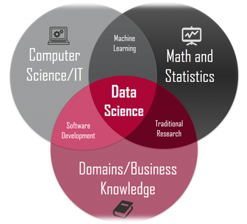
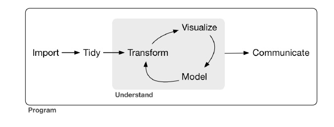

```{r setup, include=FALSE}
knitr::opts_chunk$set(echo = TRUE)
```

## Sekilas Tentang Data Science
 - Perkembangan dunia digital dalam beberapa dekade terakhir telah mendorong kebutuhan akan data meningkat pesat.
 - data is the new oil.
 - Perkembangan proses bisnis yang berbasis digital:
   - e-commerce
   - berbagai layanan publik mulai berbasis internet
   - sektor pendidikan juga mulai bergeser pada e-learning
   - etc.

## Apa itu data science?



[Sumber: Pengenalan Data Science](https://medium.com/@jrendz/pengenalan-data-science-b49a52eeef9c)

## Data Science Workflow



Sumber: R For Data Science

## Mengapa R?
- Dua bahasa pemrograman yang paling populer: R dan Python [, dan SQL]
- R gratis dan open source
- didesain secara khusus untuk **statistical computing** dan **graphics**
- supporting community yang besar 
  - Stackoverflow
  - Social media (Twitter: useR, facebook groups)
  - google search
- Pembuatan laporan dan presentasi (**rmarkdown**)
- Powerful webapp (**shiny**, **shinydashboard**, **flexdashboard**)
- Akademia: reproducibility

## Data Structure (Container)
- Atomic Vectors
  - Double --> Numeric
  - Integer --> Numeric
  - Character (string)
  - Logical (`TRUE` atau `FALSE`)
- List
- Matrix
- Data Frame
- Array (multi-dimensional Array)

## 1. Vector
- Vector didefinisikan menggunakan fungsi: `c()`
- Vector hanya bisa menampung data dengan type yang sama

Contoh:

Vector Double (Numeric)
```{r}
x <- c(1, 10, 21, 15, 20)
x
typeof(x) #untuk mengecek type data
```

## 1. Vector
Vector Integer

R mendefinisikan type data integer dengan suffix L

```{r}
y <- c(1L, 3L, 10L, 21L, 30L)
y
typeof(y)
```

## 1. Vector
Vector Character

character ditandai dengan double/single quote
contoh:

```{r}
buah <- c("pisang", 'mangga', 'apel', "manggis", "semangka")
buah
typeof(buah)
```

## 1. Vector
Vector Logical
contoh:
```{r}
logi <- c(TRUE, FALSE, FALSE, TRUE, FALSE)
logi
typeof(logi)
```

## 1. Vector
Cara lain mendifinisikan vector:
```{r}
# biasanya digunakan untuk mendefinisikan empty vector
x <- double()
x
y <- integer()
y
```

## 1. Vector
```{r}
z <- character()
z
a <- logical()
a
```

## 2. List
- List didefinisikan menggunakan fungsi: `list()`
- List dapat menampung data dengan type yang berbeda
- Element dalam list dapat mencakup banyak vector
- Memberikan fleksibilitas dalam melakukan analisis data

## 2. List
Contoh:
```{r}
li <- list(c(1,2,3), c("a", "b"), c(1L, 10L), c(TRUE, FALSE))
li
```

## 3. Matrix
- didefinisikan menggunakan fungsi: `matrix()`
- setiap element dalam matrix memiliki type data yang sama

Contoh:

```{r}
mat <- matrix(1:20, nrow = 4, byrow = TRUE)
mat
class(mat)
``` 

## 4. Multi-Dimensional Array
- Didefinisikan dengan fungsi: `array()`
- Jarang digunakan dalam data analysis

Contoh:

```{r}
array(data = list(1:5, 6:10), dim = 2)
```

## 5. Data Frame
- Didefinisikan dengan fungsi: `data.frame()`
- Paling sering digunakan dalam analisis
- Bentuk special dari matrix dan list
- Terdiri dari vector - vector pada setiap kolom
- Observasi/amatan pada baris
- Setiap kolom dapat memiliki type data berbeda

## 5. Data Frame
Contoh:

```{r}
df <- data.frame(x = c(1:5), 
                 y = c("apel", "pisang", "mangga", "semangka", "rambutan"), 
                 z = c(TRUE, TRUE, FALSE, FALSE, TRUE))

df
```

## Missing Values
- R merepresentasikan nilai yang hilang (`missing values`) atau nilai yang tidak diketahui dengan `NA` (not applicable)
- Missing values bersifat contagious
- setiap type data memiliki missing values: `NA` (logical), `NA_ real_` (double), `NA_integer_` (integer), `NA_character` (character)

Contoh:
```{r}
x <- c(1,2,3, NA, 5)
mean(x)
```

## Testing dan Coercion
- Testing untuk memastikan bahwa suatu vector memiliki type data tertentu
- Coercion untuk mengubah suatu type data ke type data yang lain

Contoh 1:
```{r}
x <- c(1,2,3,4,5)
is.numeric(x) #testing
is.character(x)
```

## Testing dan Coercion
Contoh 2:
```{r}
x <- c(1,2,3,4,5)
typeof(x)
x <- as.character(x) #coercion
typeof(x)
```

## DEMO

